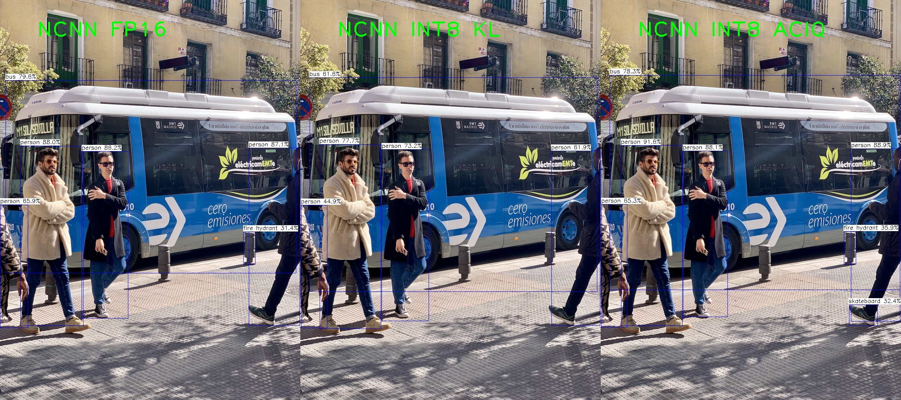

YOLOv5转NCNN

## update20210608

新增yolov5模型剪枝和NCNN INT8量化。


项目持续更新，主要包括yolov5s模型的剪枝，int8量化，ncnn模型转换和Android移植测试。


基于YOLOv5最新[v5.0 release](https://github.com/ultralytics/yolov5/releases/tag/v5.0)，和NCNN官方给出example的差别主要有：

- 激活函数hardswish变为siLu；
- 流程和[详细记录u版YOLOv5目标检测ncnn实现](https://zhuanlan.zhihu.com/p/275989233?utm_source=qq)略微不同

## 编译运行

动态库用的是官方编译好的ncnn-20210507-ubuntu-1604-shared

```
mkdir build 
cd build
cmake ..
make -j8
./yolov5 ../bus.jpg
```

可以看到:

<p align="center">

</p>


## 安卓

参考https://github.com/nihui/ncnn-android-yolov5 ，使用这里转的v5.0分支的ncnn模型。

## Yolov5s剪枝
见https://github.com/midasklr/yolov5prune
稀疏训练+Bn层剪枝，可以获得更加紧凑的模型，这里一次稀疏训练+60%Bn层剪枝，模型从28M降低到7M。

## 流程

以下为yolov5s.pt转NCNN流程，自己训练的模型一样：

## pytorch测试和导出onnx

先测试下yolov5s效果：

```
python detect.py --weights yolov5s.pt --source data/images
```

效果不错：

<p align="center">

</p>


导出 onnx，并用 onnx-simplifer 简化模型，这里稍微不同，如果按照[详细记录u版YOLOv5目标检测ncnn实现](https://zhuanlan.zhihu.com/p/275989233?utm_source=qq),那么直接导出来的模型可以看到输出:

```
python models/export.py --weights yolov5s.pt --img 640 --batch 1
```

<p align="center">

</p>


可以看到后处理怎么都出来了？？？

看看models/yolo.py代码发现：

<p align="center">

</p>

inference里面不就对应上面onnx模型那部分输出处理后然后torch.cat起来么，这部分处理我们放在代码里面做，所以可以注释这部分：

<p align="center">

</p>

这样导出来的模型就是三个输出了：

<p align="center">

</p>


ok,输出和[详细记录u版YOLOv5目标检测ncnn实现](https://zhuanlan.zhihu.com/p/275989233?utm_source=qq)对应上了，同时可以看到激活函数silu：

<p align="center">

</p>

经过onnx-sim简化一下：

```
python -m onnxsim yolov5s.onnx yolov5s-sim.onnx
```

## 转换和实现focus模块等

后续和[详细记录u版YOLOv5目标检测ncnn实现](https://zhuanlan.zhihu.com/p/275989233?utm_source=qq)一样，ncnn转化后激活函数转为swish,可swish的实现：

```c++
Swish::Swish()
{
    one_blob_only = true;
    support_inplace = true;
}

int Swish::forward_inplace(Mat& bottom_top_blob, const Option& opt) const
{
    int w = bottom_top_blob.w;
    int h = bottom_top_blob.h;
    int channels = bottom_top_blob.c;
    int size = w * h;

    #pragma omp parallel for num_threads(opt.num_threads)
    for (int q = 0; q < channels; q++)
    {
        float* ptr = bottom_top_blob.channel(q);

        for (int i = 0; i < size; i++)
        {
            float x = ptr[i];
            ptr[i] = static_cast<float>(x / (1.f + expf(-x)));
        }
    }

    return 0;
}

} // namespace ncnn
```

和silu一样，那么就可以正常进行推理了，可能需要注意的就是三个输出节点不要弄错就ok。


## INT8量化

### 1. NCNN源码编译

1. 最新ncnn新增支持int8量化

```
git clone https://github.com/Tencent/ncnn.git
cd ncnn
git submodule update --init
```

2. 增加Focus层

   将layer/yolov5focus.cpp/.h 两个文件放在ncnn/src/layer下，然后ncnn/src/CMakeList.txt增加：

   ```
   ncnn_add_layer(YoloV5Focus)
   ```

3. 编译

不同系统的编译见https://github.com/Tencent/ncnn/wiki/how-to-build

编译完成后会有：

ncnn/build/tools/onnx/onnx2ncnn ：用于onnx转ncnn的工具

/ncnn/build/tools/ncnnoptimize 优化工具

ncnn/build/tools/quantize/ncnn2int8 转int8

ncnn/build/tools/quantize/ncnn2table 生成校准表

### 2. 模型量化

参考https://github.com/Tencent/ncnn/wiki/quantized-int8-inference 操作，在ncnn2table工具下，准备我们的检验图片放在images文件夹下，最好是我们训练模型的验证或者测试集，这里使用coco val数据集5k张图片。

然后

```
find images/ -type f > imagelist.txt
./ncnn2table yolov5s-opt.param yolov5s-opt.bin imagelist.txt yolov5s.table mean=[0,0,0] norm=[0.0039215,0.0039215,0.0039215] shape=[416,416,3] pixel=BGR thread=8 method=kl
```

<p align="center">

</p>
校准表见INT8/yolov5s.table。

然后转化模型：

```
./ncnn2int8 yolov5s-opt.param yolov5s-opt.bn yolov5s-int8.param yolov5s-int8.bin yolov5s.table
```

转化后的int8模型见yolov5s-int8.param和yolov5s-int8.bin。

### 3. INT8 推理

使用最新的动态库：https://github.com/Tencent/ncnn/releases/tag/20210525

根据你的系统选择。

相关设置：

```
    yolov5.opt.num_threads = 8;
    yolov5.opt.use_int8_inference = true;
```

FP16模型和INT8模型对比：

<p align="center">

</p>


kl和aciq两种量化方式，前者损失会更大。


|               | input | inference time | model size |
| ------------- | ----- | -------------- | ---------- |
| yolov5s       | 416   | 22 ms          | 14.6 M(fp16)     |
| yolov5s-prune | 416   | 18 ms          | 1.7 M(fp16)      |
| yolov5s-int8  | 416   | 52ms           | 887.5k(int8)     |

目前int8量化后效果还不错，但是推理时间慢了很多，可能原因是int8不针对x86，参考https://github.com/Tencent/ncnn/issues/2974
后续测试arm上加速效果
